## Inhaltsverzeichnis

- [Aufbau der Laborumgebung](#aufbau-der-laborumgebung)
- [Log-Sammlung](#log-sammlung)
  - [Datenquellen](#datenquellen)
  - [Datenfluss](#datenfluss)
- [Die Logs im Wazuh Dashboard](#die-logs-im-wazuh-dashboard)
  - [Windows Event](#windows-event)
  - [Kali Event](#kali-event)
- [Regeln und Alarme](#regeln-und-alarme)
  - [Funktionsweise von Rules](#funktionsweise-von-rules)
  - [Eigene Rule erstellen](#eigene-rule-erstellen)
  - [Testevent erzeugen](#testevent-erzeugen)
  - [Alert im Dashboard](#alert-im-dashboard)
- [Korrelation](#korrelation)
  - [Korrelationsregel erstellen](#korrelationsregel-erstellen)
  - [Korrelationsregel testen](#korrelationsregel-testen)
- [Dashboards und Visualisierung](#dashboards-und-visualisierung)
- [Threat Intelligence](#threat-intelligence)
  - [Einbindung von VirusTotal](#einbindung-von-virustotal)
  - [VirusTotal Testing](#virustotal-testing)

# SIEM Lab Wazuh
Im Rahmen dieses Projekts wurde eine eigene SIEM-Laborumgebung mit Wazuh aufgebaut. Ziel ist es, die grundlegenden Funktionen eines Security Information and Event Management Systems praktisch kennenzulernen und ein solides Verständnis für Log-Sammlung, Event-Analyse, Alerting und Korrelation aufzubauen.

## Aufbau der Laborumgebung
Die gesamte Laborumgebung läuft auf meinem MacBook Pro (M3). Darauf ist Docker Desktop sowie VMware Fusion als Hypervisor installiert. Als SIEM habe ich mich für die Opensource Lösung Wazuh entschieden. Wazuh läuft lokal auf dem MacBook in Docker Containern. Als Client-Systeme verwende ich Windows 11 und Kali Linux. Die beiden Systeme laufen als Virtuelle-Maschinen in VMware Fusion. Auf den beiden Clients wurde dann der Wazuh Agent installiert.

Die nachfolgende Grafik zeigt den Aufbau der Laborumgebung auf:

  
   
  <em>Aufbau Laborumgebung</em>

## Log-Sammlung
Die zentrale Sammlung von Logdaten ist eine grundlegende Funktion eines SIEM. Anstatt die Logs ausschliesslich lokal auf den einzelnen Systemen zu speichern, werden sie an Wazuh übertragen und sollen dort zentral verarbeitet und analysiert werden. 

### Datenquellen
In dieser Laborumgebung werden die Windows-11- und Kali-Linux-VM als Datenquellen verwendet. Auf beiden Systemen ist ein Wazuh Agent installiert, welcher die relevanten Logdaten erfasst und an den Wazuh Manager überträgt. Damit die Logs an Wazuh gesendet werden können, muss auf den Client-Systemen der Wazuh Agent installiert werden. 

Auf diesen beiden Screenshots ist zusehen, dass der Agent als lokaler Service auf den Systemen installiert wurde.

  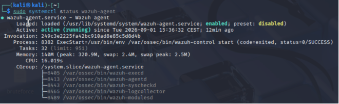
   
  <em>Wazuh Agent auf Kali</em>

  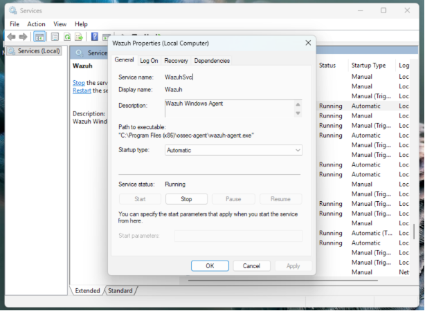
   
  <em>Wazuh Agent auf Windows</em>

Im Wazuh Dashboard werden die beiden Agents bzw. Systeme die mit dem Manager verbunden sind angezeigt:

  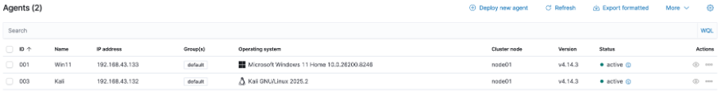
   
  <em>Agents in Wazuh Dashboard</em>

### Datenfluss
Die Logdaten werden auf den Windows- und Kali-Systemen durch den jeweiligen Wazuh Agent erfasst und an den zentralen Wazuh Manager übertragen. Der Manager verarbeitet und analysiert die eingehenden Events anhand von Decodern und Regeln. Anschliessend werden die aufbereiteten Daten im Wazuh Indexer gespeichert und über das Wazuh Dashboard für Suche, Analyse und Visualisierung bereitgestellt.

## Die Logs in Wazuh Dashboard
In diesem Kapitel wird aufgezeigt, dass die Logs erfolgreich an den Wazuh Manager gesendet und im Dashboard angezeigt werden können.

### Windows Event
Zur Überprüfung der Log-Sammlung, wurde bewusst ein falsches Passwort bei der Anmeldung eingegeben. Dabei wird bei Windows ein Security Event mit der Event-ID “4625” generiert:

  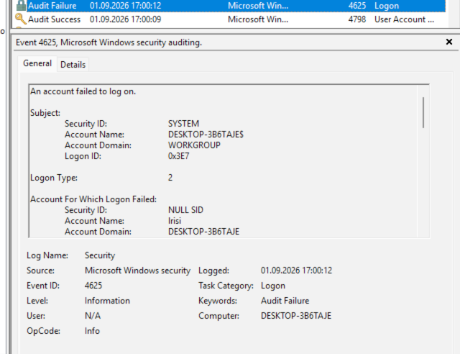
   
  <em>Windows Event</em>

Der Wazuh Agent erfasst dieses Ereignis und überträgt es an den Wazuh Manager. Im Wazuh Dashboard kann das Event anschliessend analysiert werden:

  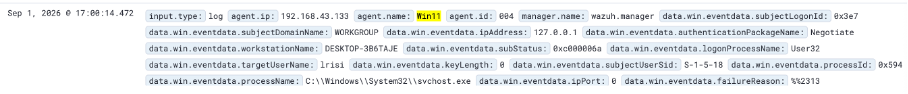
   
  <em>Failed Windows Logon 1/2</em>

  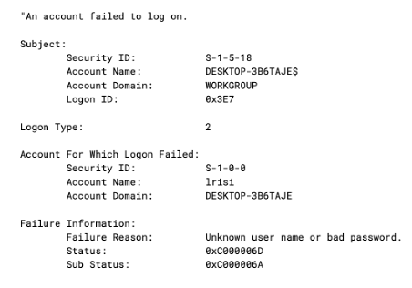
   
  <em>Failed Windows Logon 2/2</em>

### Kali Event
Auf der Kali VM wurde ebenfalls ein fehlgeschlagener Authentifizierungsversuch erzeugt. Das Ereignis wurde über das systemd Journal erfasst und durch den Wazuh Agent an den Manager übertragen. Im Dashbord sieht dies wie folgt aus:

  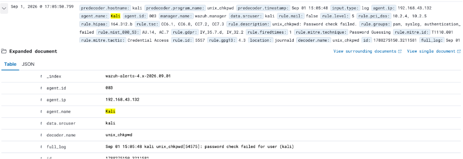
   
  <em>Failed Linux Logon</em>

## Regeln und Alarme
In diesem Kapitel wird anhand einer einfachen Testregele gezeigt, wie eigene Regeln in Wazuh erstellt und gezielt ausgelöst werden können. 

### Funktionsweise von Rules
In Wazuh können eingehende Events anhand von definierten Regeln erstellt ausgewertet. Eine Regel legt fest, auf welche Merkmale eines Events reagiert werden soll und welcher Schweregrad einem Treffer zugewiesen wird. Wird eine Regel erfüllt, kann daraus ein Alert also ein Alarm entstehen. Neben den bereits vorhandenen Standardregeln können auch eigene Regeln erstellt werden. Dadurch lässt sich Wazuh an spezifische Anforderungen anpassen. 

### Eigene Rule erstellen
Für das Lab wurde eine eigene Regel erstellt. Regeln können im Dashboard unter «Server Management» > «Rules» erstellt werden.
Die Regel wird ausgelöst, wenn ein eingehendes Event den String «SIEM_CUSTOM_RULE_TEST» enthält. Der erzeugte Alert erhält den den Schweregrad «10». 

  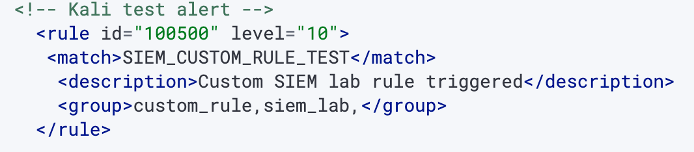
   
  <em>Test Regel</em>

### Testevent erzeugen
Um diese Regel zu testen, wurde auf der Kali-VM ein eigenes Event erzeugt:

  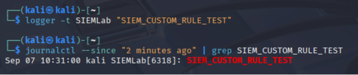
   
  <em>Kali Testevent erzeugen</em>

### Alert im Dashboard
In Wazuh kann man nach der definierten Rule ID filtern und der Alert wird angezeigt. Dies zeigt, dass der Agent das Testevent erfasst hat und an den Wazuh Manager weitergeleitet hat. Auch der Schweregrad wurde korrekt gesetzt. 

  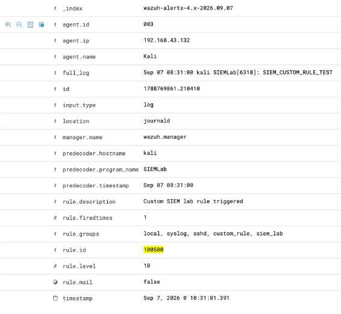
   
  <em>Custom Alert in Wazuh Dashboard</em>

Mit diesem Test konnte gezeigt werden, dass eigene Regeln in Wazuh erstellt und gezielt ausgelöst werden können. Durch die Definition eigener Bedingungen lässt sich das SIEM an spezifische Logquellen und Anwendungsfälle anpassen. Sobald ein eingehendes Event die definierte Bedingung erfüllt, kann Wazuh daraus automatisch einen Alert mit einem festgelegten Schweregrad erzeugen. 

## Korrelation
Einzelne Events sind nicht immer aussagekräftig genug, um einen möglichen Sicherheitsvorfall zu erkennen. Bei der Korrelation werden deshalb mehrere Ereignisse miteinander in Beziehung gesetzt. Dabei können beispielsweise die Anzahl von Event, deren Reihenfolge oder ein bestimmtes Zeitfenster berücksichtig werden. In Wazuh können Korrelationsregeln so definiert werden, dass ein zusätzlicher Alert ausgelöst wird, wenn mehrere passende Ereignisse innerhalb eines festgelegten Zeitraums auftreten. 

### Korrelationsregel erstellen
Für das Lab können zwei einfache Testevents verwendet werden: «EVENT_A» und «EVENT_B». Beide Events werden zuerst durch eigene Regeln erkannt. Eine dritte Regel wertet anschliessend aus, ob beide Events innerhalb von zwei Minuten auftreten. 
Die Regeln «100510» und «100511» erkennen die beiden einzelnen Testevent. Beide werden der Gruppe «siem_corr_test» zugeordnet. Die Korrelationsregel «100512» prüft, ob innerhalb von 120 Sekunden zwei Events aus dieser Gruppe auftreten. Ist dies der Fall, wird ein zusätzlicher Alert mit dem Schweregrad 12 erzeugt.

  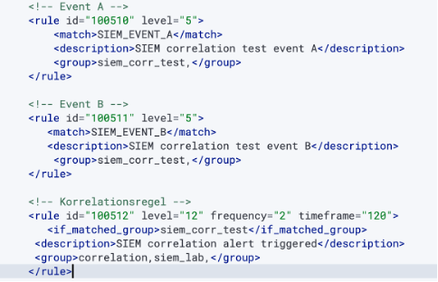
   
  <em>Korrelationsregel erstellen</em>

### Korrelationsregel testen
Um die Korrelationsregel zu testen, wurden zwei Testevents auf der Kali-VM erstellt.

  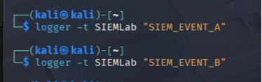
   
  <em>Korrelationsregel testen Kali</em>

Beide Events wurden vom Wazuh Agent erfasst und durch die jeweiligen Regeln erkannt. Dadurch entstanden zunächst zwei einzelne Alerts. Da beide Events innerhalb des definierten Zeitfensters aufgetreten sind, wurde zusätzlich die Korrelationsregel ausgelöst. Der daraus erzeugte Alert besitzt einen höheren Schweregrad und signalisiert, dass mehrere zusammengehörigen Ereignisse innerhalb kurzer Zeit aufgetreten sind. 

  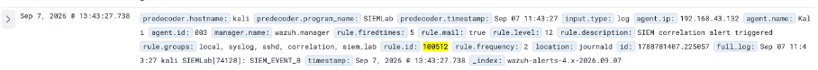
   
  <em>Korrelationsevent in Wazuh</em>

## Dashboards und Visualisierung
Mit Dashboards können sicherheitsrelevante Ereignisse übersichtlich darstellen. Anstatt einzelne Events manuell zu durchsuchen, können wichtige Kennzahlen und Auffälligkeiten zentral visualisiert werden.

  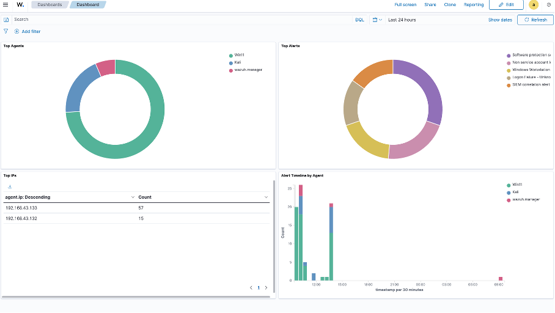
   
  <em>Dashboard</em>

Die Visualisierung «Top Agents» zeigt, welche Systeme im ausgewählten Zeitraum die meisten Alerts erzeugt haben. Dadurch lässt sich schnell erkennen, auf welchem Endpoint die höchste sicherheitsrelevante Aktivität festgestellt wurde. Bei den «Top Alerts» wird die am häufigsten ausgelösten Wazuh Regeln angezeigt. Damit lässt sich erkennen, welche Arten von Ereignissen im betrachteten Zeitraum besonders häufig auftreten.  Die Tabelle «Top IPs» zeigt die IP-Adressen der Agents, von denen die meisten Alerts stammen. Die Visualisierung «Alert Timeline by Agent» zeigt die Anzahl der erzeugten Alerts im zeitlichen Verlauf. Dadurch können zeitliche Peaks sowie ungewöhnliche Häufungen erkannt und direkt einem bestimmten System zugeordnet werden. 

## Threat Intelligence
Threat Intelligence bezeichnet Informationen über bekannte Bedrohungen und Indicators of Compromise (IOCs). Dazu zählen beispielsweise verdächtige oder bekannte schädliche IP-Adressen, Domains, URLs und Datei-Hashes. Durch die Einbindung solcher Informationen in einem SIEM können eingehende Events mit externen Bedrohungsdaten angereichert werden. Dadurch lässt isch beispielsweise schneller erkennen, ob eine aufgerufene Domain oder URL bereits als schädlich bekannt ist.

### Einbindung von VirusTotal
VirusTotal ist eine Plattform, welche Dateien, URLs, Domains und weitere Indicators anhand verschiedene Security Engines und Datenquellen analysiert.
Für das Lab wird VirusTotal in in Wazuh integriert, sodass relevante Indicators aus Events automatisiert überprüft werden können. Dazu wird ein VirusTotal API Key verwendet und die Integration im Wazuh Manager konfiguriert. 
Der ApI-Key wird auf dem Wazuh Manager in der Datei «/var/ossec/etc/ossec.conf» abgelegt. Auf dem Screenshot ist der echte Schlüssel bewusst nicht sichtbar, sondern durch einen Platzhalter ersetzt, damit keine Zugangsdaten in der Dokumentation veröffentlicht werden.

  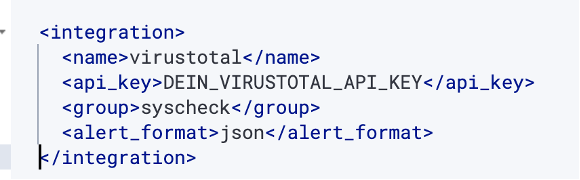
   
  <em>Virustotal API</em>

### VirusTotal Testing
Zum Testen wurde ein neues Verzeichnis «/opt/siem-test» erstellt welches von Wazuh überwacht wird. Zur Überprüfing der VirusTotal-Integration wurde die EICAR-Testdatei in das durch Wazuh überwachte Verzeichnis abgelegt.

  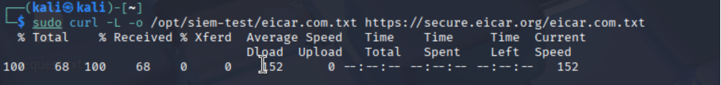
   
  <em>Virustotal Testing 1/2</em>

Die Datei wurde durch File Integrity Monitoring erkannt und ihr Hash automatisiert an VirusTotal übermittelt. VirusTotal identifizierte die Datei als bekanntes Test-Malware-Sample- Insgesamt meldeten 64 von 67 Engines einen positiven Treffer. Wazuh erzeugte daraufhin einen Alert mit Schweregrad «12».
 

  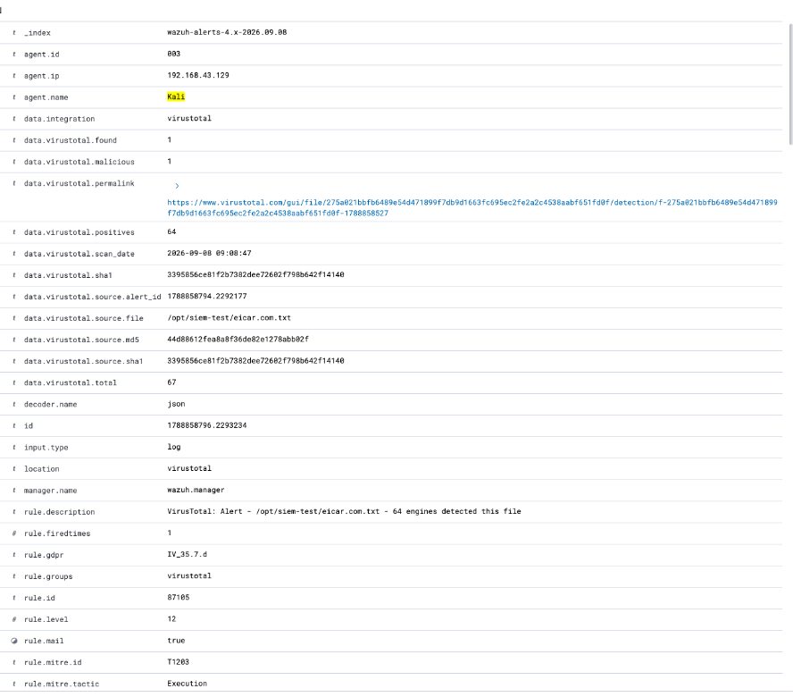
   
  <em>Virustotal Testing 2/2</em>

Der Test zeigt, wie Wazuh lokale Ereignisse mit externen Threat-Intelligence-Daten anreichern kann. Während eine normale FIM-Regel lediglich erkennt, dass eine Datei erstellt oder verändert wurde, liefert VirusTotal zusätzlichen Kontext zur Reputation des Datei-Hashes. Dadurch können verdächtige Dateien schneller verwertet und priorisiert werden. 
