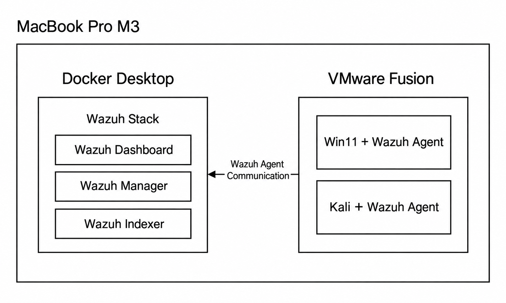

# SIEM Lab Wazuh
Im Rahmen dieses Projekts wurde eine eigene SIEM-Laborumgebung mit Wazuh aufgebaut. Ziel ist es, die grundlegenden Funktionen eines Security Information and Event Management Systems praktisch kennenzulernen und ein solides Verständnis für Log-Sammlung, Event-Analyse, Alerting und Korrelation aufzubauen.

## Aufbau der Laborumgebung
Die gesamte Laborumgebung läuft auf meinem MacBook Pro (M3). Darauf ist Docker Desktop sowie VMware Fusion als Hypervisor installiert. Als SIEM habe ich mich für die Opensource Lösung Wazuh entschieden. Wazuh läuft lokal auf dem MacBook in Docker Containern. Als Client-Systeme verwende ich Windows 11 und Kali Linux. Die beiden Systeme laufen als Virtuelle-Maschinen in VMware Fusion. Auf den beiden Clients wurde dann der Wazuh Agent installiert.

Die nachfolgende Grafik zeigt den Aufbau der Laborumgebung auf:

  
   
  <em>Aufbau Laborumgebung</em>

